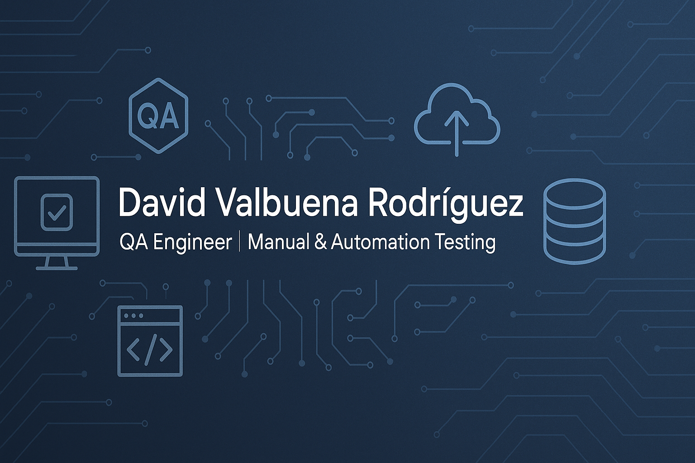

<!-- Portada -->

  

# 👋 Hola, soy David Valbuena Rodríguez

💻 **QA Engineer | Software Tester | Junior Developer en formación**  

Soy un profesional en calidad de software con experiencia en **pruebas funcionales, diseño de casos de prueba y validación de APIs**.  
Actualmente me estoy especializando en **automatización de pruebas** y en el aprendizaje de **Python y Ruby** para ampliar mis capacidades técnicas.

---

## 🚀 Tecnologías y herramientas
- ✅ **Pruebas funcionales y de regresión**  
- ✅ **Automatización en curso** (Python, Ruby)  
- ✅ **Validación de APIs** con Postman y SoapUI  
- ✅ **Pruebas de carga** con JMeter  
- ✅ **Gestión de incidencias** con Jira, Azure DevOps  
- ✅ **Entornos en la nube**: AWS y GCP  

---

## 📂 Proyectos destacados
🔹 **Proyecto QA - Urban Grocers API**  
Pruebas automatizadas en Python con `pytest`, validando la creación y gestión de kits en la aplicación.  

🔹 **Proyecto QA - Aplicación de Taxis**  
Búsqueda de información en logs, consultas SQL y análisis de relaciones entre tablas para garantizar la integridad de datos.  

---

## 🌱 Actualmente aprendiendo
- Programación en **Python y Ruby**  
- Mejores prácticas en **automatización de pruebas**  
- Frameworks de testing como **Selenium y Pytest**  

---

## 📫 Conéctemos
- 🌐 [LinkedIn](www.linkedin.com/in/dafevaro)  
- 💻 [GitHub](https://github.com/david80485)  
- ✉️ davidrodriguez290@gmail.com  

---

⭐️ *Siempre abierto a nuevos retos y oportunidades en QA y automatización.*  

