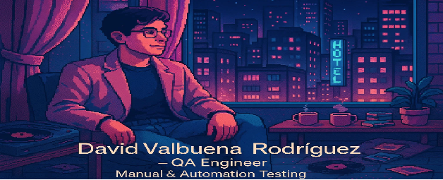

<!-- Portada -->

  

# 👋 Hello, soy David Valbuena Rodriguez

💻 **QA Engineer | Software Tester | Developer en formación**  

Profesional en **calidad de software** con experiencia en **pruebas funcionales, diseño de casos de prueba, validación de APIs y análisis de datos**.  
Actualmente me desempeño como **QA Tester en Foundever**, además de estar especializándome en **automatización de pruebas** con Python y Ruby para ampliar mis capacidades técnicas.

---

## 🚀 Tecnologías y herramientas
- ✅ **Pruebas funcionales y de regresión**  
- ✅ **Automatización en curso** (Python, Ruby)  
- ✅ **Validación de APIs** con Postman y SoapUI  
- ✅ **Pruebas de carga** con JMeter  
- ✅ **Gestión de incidencias** con Jira, Azure DevOps  
- ✅ **Entornos en la nube**: AWS y GCP  

---

## 📂 Proyectos destacados
🔹 **Proyecto QA - Urban Grocers API**  
Pruebas automatizadas en Python con `pytest`, validando la creación y gestión de kits en la aplicación.  

🔹 **Proyecto QA - Aplicación de Taxis**  
Búsqueda de información en logs, consultas SQL y análisis de relaciones entre tablas para garantizar la integridad de datos.  

---

## 💼 Experiencia laboral
- **QA Tester - Foundever**  
  📅 *2024 - Actualidad*  
  - Ejecución de **pruebas funcionales y de regresión** en entornos web y móviles.  
  - Validación de **flujos críticos de negocio** y reporte de incidencias en Jira.  
  - Colaboración en un entorno **ágil (Scrum)** con desarrolladores y product owners.  
  - Atención al detalle en la documentación de resultados y trazabilidad de defectos.  

- **QA Tester - Proyecto Urban Grocers (Formación en Automatización)**  
  📅 *2025*  
  - Desarrollo de pruebas automatizadas con Python y `pytest`.  
  - Validación de endpoints de API REST y gestión de datos en JSON.  
  - Ejecución de pruebas funcionales y de regresión.  

- **QA Tester - Proyecto App de Taxis (Base de Datos y Logs)**  
  📅 *2025*  
  - Análisis de logs del sistema y depuración de errores.  
  - Ejecución de consultas SQL para validación de datos.  
  - Revisión de integridad de relaciones entre tablas con diagramas ER.  

---

## 🌱 Actualmente aprendiendo
- Programación en **Python y Ruby**  
- Mejores prácticas en **automatización de pruebas**  
- Frameworks de testing como **Selenium y Pytest**  

---

## 📫 Conéctemos
- 🌐 [LinkedIn](https://www.linkedin.com/in/david80485)  
- 💻 [GitHub](https://github.com/david80485)  
- ✉️ davidrodriguez290@gmail.com  

---

⭐️ *Siempre abierto a nuevos retos y oportunidades en QA y automatización.*  

